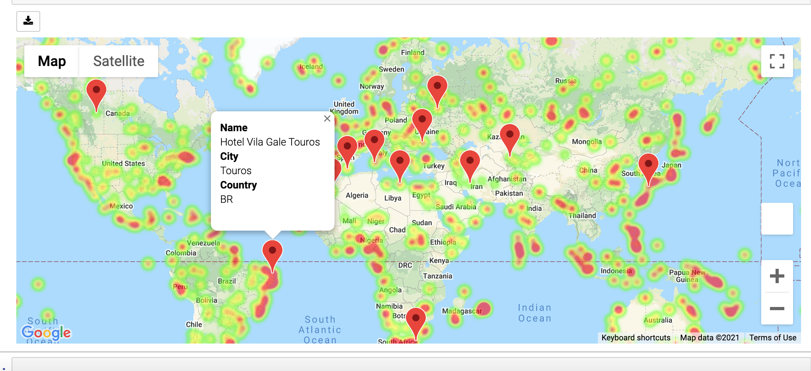

# Python API Homework - What's the Weather Like?
### Part II - VacationPy

Now let's use your skills in working with weather data to plan future vacations. Use jupyter-gmaps and the Google Places API for this part of the assignment.

* For Part II, you must include a screenshot of the heatmap you create and include it in your submission.

* Create a heat map that displays the humidity for every city from the part I of the homework.

  

* Using Google Places API to find the first hotel for each city located within 5000 meters of your coordinates.

* Plot the hotels on top of the humidity heatmap with each pin containing the **Hotel Name**, **City**, and **Country**.

  

