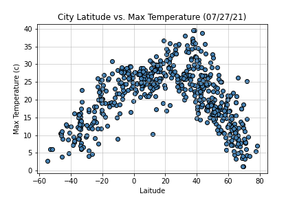
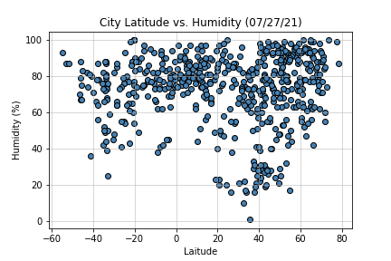
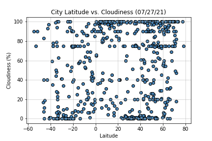

# Python API Homework - What's the Weather Like?

## Part I - WeatherPy

In this example, you'll be creating a Python script to visualize the weather of 500+ cities across the world of varying distance from the equator. To accomplish this, you'll be utilizing a [simple Python library](https://pypi.python.org/pypi/citipy), the [OpenWeatherMap API](https://openweathermap.org/api), and a little common sense to create a representative model of weather across world cities.

* For Part I, you must include a written description of three observable trends based on the data.

Your first requirement is to create a series of scatter plots to showcase the following relationships:

* Temperature (c) vs. Latitude

* Humidity (%) vs. Latitude

* Cloudiness (%) vs. Latitude

* Wind Speed (mph) vs. Latitude
.png)

