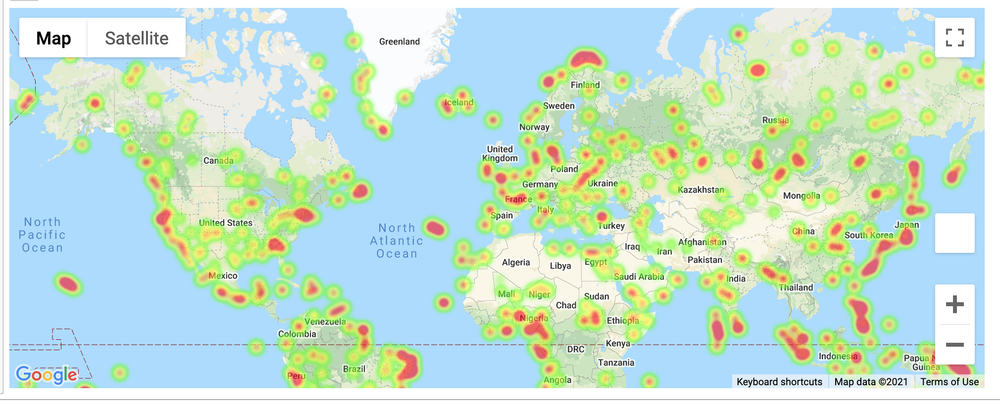
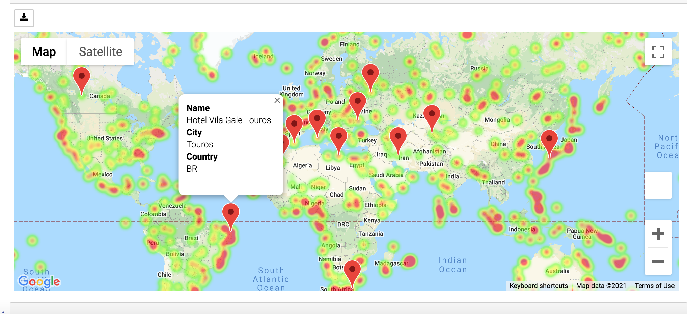

# Python API Homework - What's the Weather Like?

## Part I - WeatherPy

In this example, you'll be creating a Python script to visualize the weather of 500+ cities across the world of varying distance from the equator. To accomplish this, you'll be utilizing a [simple Python library](https://pypi.python.org/pypi/citipy), the [OpenWeatherMap API](https://openweathermap.org/api), and a little common sense to create a representative model of weather across world cities.

Your first requirement is to create a series of scatter plots to showcase the following relationships:

* Temperature (F) vs. Latitude
* Humidity (%) vs. Latitude
* Cloudiness (%) vs. Latitude
* Wind Speed (mph) vs. Latitude

* Northern Hemisphere - Temperature (F) vs. Latitude
* Southern Hemisphere - Temperature (F) vs. Latitude
* Northern Hemisphere - Humidity (%) vs. Latitude
* Southern Hemisphere - Humidity (%) vs. Latitude
* Northern Hemisphere - Cloudiness (%) vs. Latitude
* Southern Hemisphere - Cloudiness (%) vs. Latitude
* Northern Hemisphere - Wind Speed (mph) vs. Latitude
* Southern Hemisphere - Wind Speed (mph) vs. Latitude

### Part II - VacationPy

Now let's use your skills in working with weather data to plan future vacations. Use jupyter-gmaps and the Google Places API for this part of the assignment.

* **Note:** Remember that any API usage beyond the $200 credit will be charged to your personal account. You can set quotas and limits to your daily requests to be sure you can't be charged. Check out [Google Maps Platform Billing](https://developers.google.com/maps/billing/gmp-billing#monitor-and-restrict-consumption) and [Manage your cost of use](https://developers.google.com/maps/documentation/javascript/usage-and-billing#set-caps) for more information.

* Create a heat map that displays the humidity for every city from the part I of the homework.

  

* Using Google Places API to find the first hotel for each city located within 5000 meters of your coordinates.

* Plot the hotels on top of the humidity heatmap with each pin containing the **Hotel Name**, **City**, and **Country**.

  

* For Part I, you must include a written description of three observable trends based on the data.
* For Part II, you must include a screenshot of the heatmap you create and include it in your submission.
